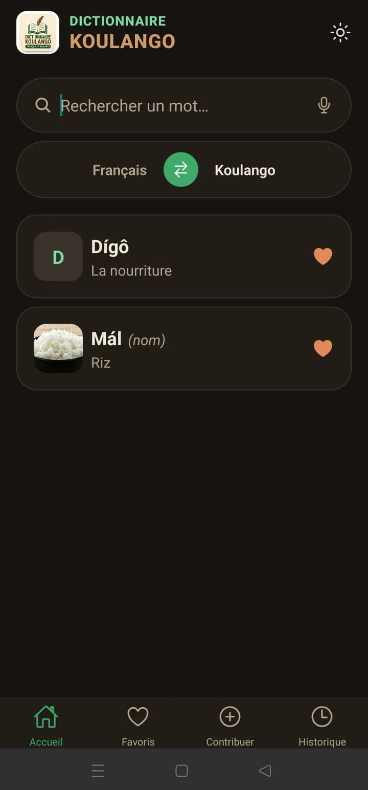
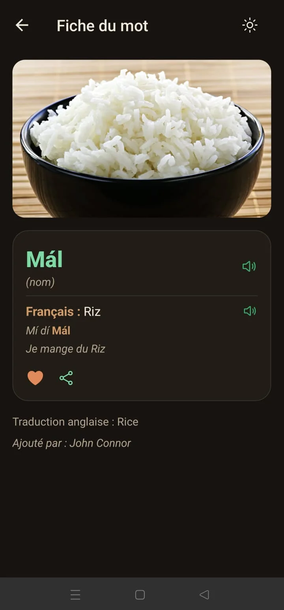
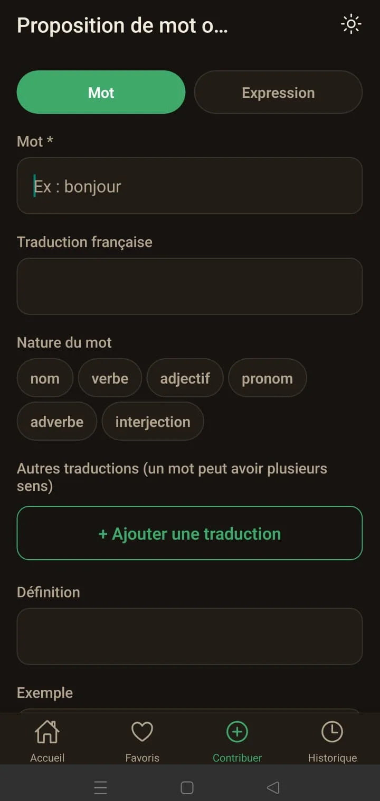

# 📖 Koulango Dictionary

Dictionnaire collaboratif de la langue **Koulango** (Côte d'Ivoire).

- 📱 **App mobile** (Android) : recherche bidirectionnelle koulango ↔ français,
  fiches enrichies (traductions multiples, définitions, exemples, audio,
  illustrations), favoris et historique locaux — **sans compte, sans
  inscription**. Toute contribution est envoyée anonymement puis validée par
  un modérateur avant publication.
- 🖥️ **Panneau d'administration web** : réservé aux modérateurs/administrateurs
  pour valider, éditer, fusionner ou supprimer des mots.
- ⚙️ **API** FastAPI (Clean Architecture) partagée par les deux clients.

> Monorepo à 3 applications : `backend/` (API) · `frontend/` (mobile Expo) ·
> `web-admin/` (SPA React de modération).

---

## 🌐 Environnements déployés

| App | URL | Hébergement |
|-----|-----|-------------|
| API | https://koulango-dictionnary.onrender.com | Render (Web Service) + Neon Postgres |
| Documentation API (Swagger) | https://koulango-dictionnary.onrender.com/docs | — |
| Admin web | https://koulango-dictionnary-1.onrender.com | Render (Static Site) |
| App mobile | APK signé à sideloader (voir [Distribution mobile](#-distribution-mobile-android)) | — |

Le service Render (offre gratuite) se met en veille après une période
d'inactivité : le premier appel après une pause peut prendre ~30-60s
(cold start) — c'est normal, l'app mobile gère ce délai (timeouts généreux +
cache hors-ligne).

---

## 📸 Captures d'écran

<p align="center">
  
  
  
</p>
<p align="center">
  <sub>Accueil & recherche · Fiche détaillée d'un mot · Proposition d'un mot</sub>
</p>

---

## ✨ Fonctionnalités

**Côté mobile (sans compte)**
- Recherche instantanée bidirectionnelle (koulango → français et français → koulango)
- Fiche détaillée : traductions multiples par mot (chacune avec son propre
  exemple et sa traduction), définitions, nature grammaticale (nom, verbe,
  adjectif…), prononciation phonétique, audio et illustration
- Proposer un mot ou une expression : vérification intelligente anti-doublon
  avant envoi (« avez-vous voulu dire… ? »)
- Prononciation audio : upload d'un fichier **ou** enregistrement direct au
  micro, envoyé uniquement au moment de la validation du formulaire
- Favoris et historique de consultation — **100 % locaux à l'appareil**,
  aucune donnée envoyée au serveur
- Partage d'un mot sous forme d'image (carte générée à la volée) via le menu
  de partage natif Android
- Mode sombre (suit le système, ou basculé manuellement)
- Fonctionne hors-ligne pour les mots déjà consultés (cache persistant)

**Côté modération (web-admin)**
- File d'attente des contributions en attente → accepter / refuser (motif
  obligatoire) / fusionner avec un mot existant
- Ajout et édition directe de mots (publication immédiate, sans file d'attente)
- Upload d'image et enregistrement audio (micro navigateur) sur le formulaire

**Côté API**
- Recherche floue (trigram + Levenshtein) pour détecter les variantes proches
  d'un mot avant création
- Limitation de débit anti-spam sur les contributions anonymes (10 par IP /
  6h, sauf modérateur/administrateur authentifié)

---

## 🧱 Stack technique

| Couche | Technologies |
|--------|--------------|
| Mobile | React Native (Expo, prebuild géré) · TypeScript · React Navigation · React Query (persisté) · Zustand (favoris/historique/thème, persistés) · expo-av · expo-image-picker · react-native-view-shot |
| Admin web | React · Vite · TypeScript · React Router · React Query |
| API | FastAPI · SQLAlchemy 2 · Pydantic v2 · JWT · Alembic · Swagger/OpenAPI |
| Base de données | PostgreSQL (Neon en prod, Docker en local) + `pg_trgm`, `fuzzystrmatch` |
| Recherche | Trigram + Levenshtein + correspondance sur définitions/exemples |
| Média | Fichiers stockés en base (`media_files`), servis via l'API |
| Déploiement | Render (API + Static Site), build Android via Gradle local ou EAS |

---

## 🚀 Démarrage rapide

### API (Docker, base locale)

```bash
git clone <repo> koulango-dictionary
cd koulango-dictionary
docker compose up --build
```

- API : http://localhost:8000
- Swagger : http://localhost:8000/docs
- Compte modérateur de démo : `admin@koulango.dev` / `Admin1234!`

Les migrations Alembic s'exécutent automatiquement au démarrage du conteneur
`api`. Pour pointer vers une base Neon (ou toute autre Postgres managée) au
lieu du conteneur local, définir `DATABASE_URL` dans `backend/.env` et lancer
l'API sans le service `db` du compose.

### App mobile

```bash
cd frontend
npm install
npm start          # puis « a » (Android) ou QR code Expo Go
```

> Sur émulateur Android, remplacer `localhost` par `10.0.2.2` dans la config
> de l'URL d'API. Sur appareil physique, utiliser l'IP LAN de la machine (ou
> pointer directement vers l'API déployée sur Render).

### Admin web

```bash
cd web-admin
npm install
npm run dev
```

---

## 📲 Distribution mobile (Android)

L'app n'est **pas encore sur le Play Store** : elle se distribue par APK signé
à installer directement (sideload). Deux façons de le générer :

**En local (recommandé, pas de quota) :**
```bash
cd frontend/android
./gradlew assembleRelease
# APK : android/app/build/outputs/apk/release/app-release.apk
```
Nécessite `credentials.json` + le keystore de release (non versionnés, à
générer une fois avec `keytool` — voir `frontend/eas.json` pour la config
`credentialsSource: local`).

**Via EAS Build (cloud, quota gratuit limité) :**
```bash
cd frontend
npx eas build --platform android --profile preview
```

L'APK est restreint aux architectures réelles (`arm64-v8a`, `armeabi-v7a`,
via un plugin de config local) pour éviter d'embarquer les libs x86 inutiles
sur un vrai téléphone (~47 Mo au lieu de ~75 Mo).

**iOS** : nécessite un compte Apple Developer Program (payant) — il n'existe
pas d'équivalent au sideload Android pour un appareil réel. Non disponible
pour l'instant.

---

## 🗂️ Architecture (API — Clean Architecture)

```
backend/app/
├── core/            # config, database, security (JWT, hachage)
├── domain/          # entités, énumérations, interfaces (ports) — sans dépendance framework
├── application/     # cas d'usage / services métier
├── infrastructure/  # modèles SQLAlchemy + repositories (adaptateurs)
├── api/             # routers FastAPI + dépendances (gardes de rôles)
└── schemas/         # DTO Pydantic (entrée/sortie)
```

Le flux de dépendances va toujours **de l'extérieur vers le domaine** :
`api → application → domain ← infrastructure`. Le domaine ne connaît ni FastAPI
ni SQLAlchemy, ce qui rend les cas d'usage testables et le stockage remplaçable.

Voir [`docs/ARCHITECTURE.md`](docs/ARCHITECTURE.md) et [`docs/API.md`](docs/API.md).

---

## 🔍 Recherche

**Recherche instantanée** (`GET /api/v1/words/search`) : bidirectionnelle
koulango ↔ français (préfixe + trigram côté koulango, sous-chaîne côté
français), étendue aux définitions et exemples (un mot dont seule une
définition contient la requête remonte aussi, après les correspondances
directes). Le paramètre `lang` ne change que la priorité d'affichage.

**Vérification intelligente avant ajout** (`GET /api/v1/contributions/check`) :
avant d'enregistrer un mot, l'API vérifie s'il existe déjà **ou** s'il existe
une variante proche, en combinant :

1. **Égalité normalisée** (minuscule + suppression d'accents) ;
2. **Similarité trigram** via `pg_trgm` (`similarity`, opérateur `%`) ;
3. **Distance d'édition** via `levenshtein` (`fuzzystrmatch`).

```json
{
  "exists": false,
  "message": "Le mot n'existe pas. Avez-vous voulu dire : kôlôngô ? Est-ce le même mot ?",
  "suggestions": [{ "word_id": 2, "term": "kôlôngô", "similarity": 0.72, "distance": 2 }]
}
```

Côté mobile, si l'utilisateur répond **Oui** (même mot), la création est
abandonnée ; sinon elle continue avec `force_create=true`.

Un index `GIN … gin_trgm_ops` sur `words.normalized` rend la similarité performante.

---

## 👤 Rôles & sécurité

Les comptes utilisateurs concernent **uniquement le panneau d'administration**
(l'app mobile ne requiert aucun compte).

| Rôle | Droits |
|------|--------|
| **Modérateur** | valider / refuser (motif obligatoire) / fusionner les contributions |
| **Administrateur** | + ajout/édition/suppression directe de mots, gestion |

- Authentification **JWT** (access + refresh), hachage **bcrypt**.
- Gardes de rôles hiérarchiques via la dépendance `require_role(...)`.
- Les contributions anonymes (mobile) sont limitées à **10 par IP / 6h**
  (anti-spam) ; ce plafond ne s'applique pas à un modérateur/administrateur
  authentifié.

---

## 🗃️ Schéma relationnel

`users`, `dialects`, `words`, `expressions`, `translations`, `definitions`,
`examples`, `pronunciations`, `audios`, `media_files`, `synonyms`,
`spelling_variants`, `contributions`, `validations`, `favorites`,
`search_history`, `reports`, `notifications`.

- Un mot peut avoir **plusieurs traductions** (`translations`), chacune avec
  son propre exemple et la traduction de cet exemple.
- La nature grammaticale (`part_of_speech`) est portée par le mot lui-même,
  pas par chaque définition.
- Favoris et historique **n'existent pas côté serveur** pour un usage
  anonyme : ils vivent uniquement dans le stockage local de l'app mobile.

Diagramme et détails : [`docs/ARCHITECTURE.md`](docs/ARCHITECTURE.md).

---

## ✅ Tests

```bash
cd backend
pip install -r requirements.txt
pytest -q          # auth, santé, contributions/limitation de débit (SQLite en mémoire)
```

> La recherche floue (`pg_trgm`/`levenshtein`) nécessite PostgreSQL ; ces cas
> sont couverts en intégration (à lancer sur la base Docker ou Neon).

---

## 📁 Structure du dépôt

```
koulango-dictionary/
├── backend/          # API FastAPI (Clean Architecture)
├── frontend/         # App mobile Expo (Android, sans compte)
├── web-admin/        # Panneau d'administration web (React/Vite)
├── docs/             # Documentation (architecture, API)
├── docker-compose.yml
└── README.md
```

---

## 📄 Licence

Projet à visée culturelle et éducative pour la préservation de la langue Koulango.
